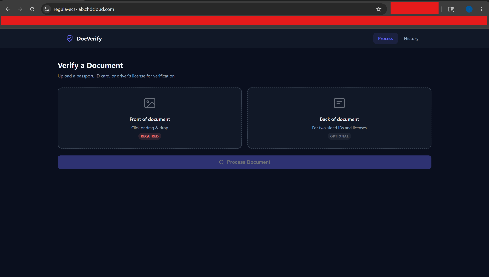
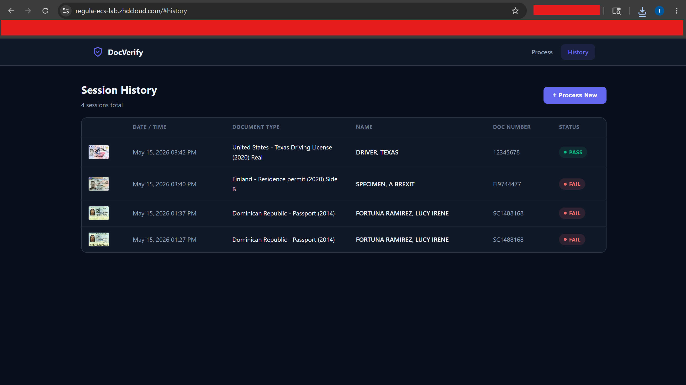
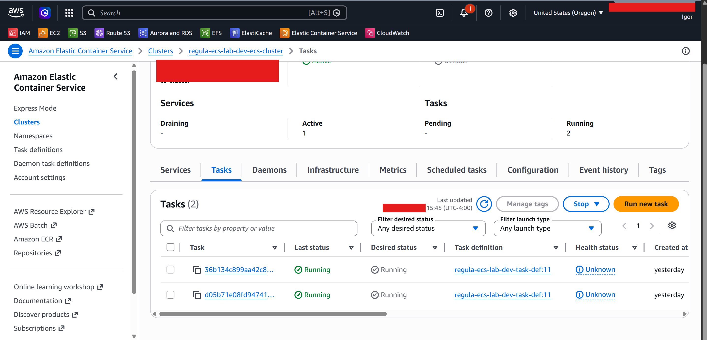
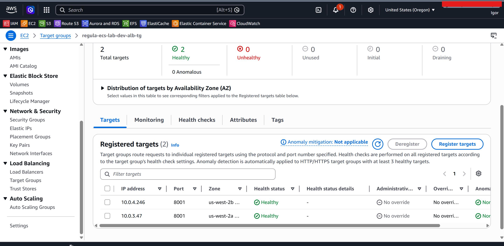
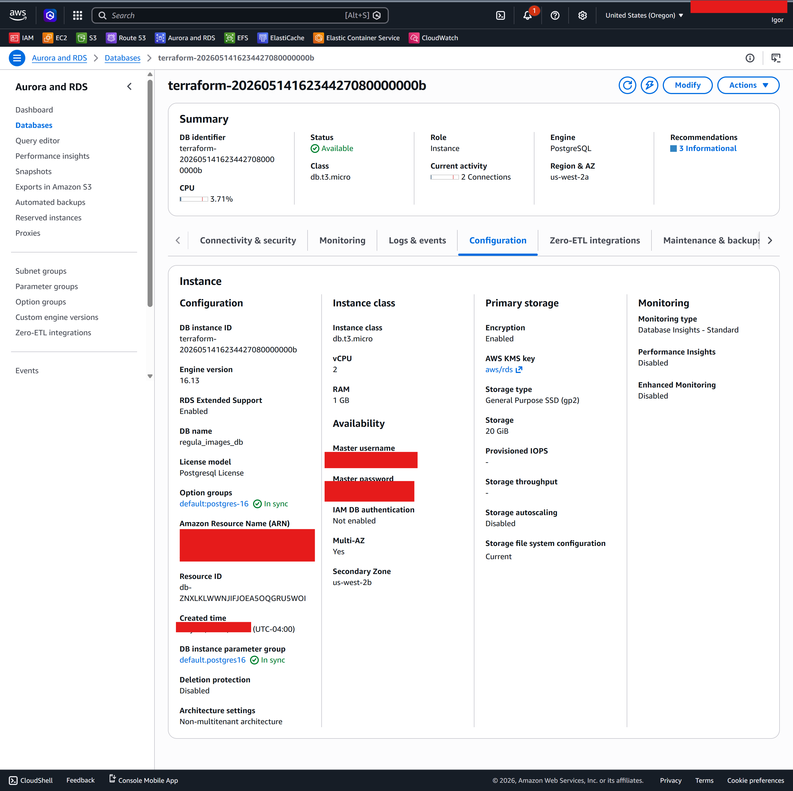
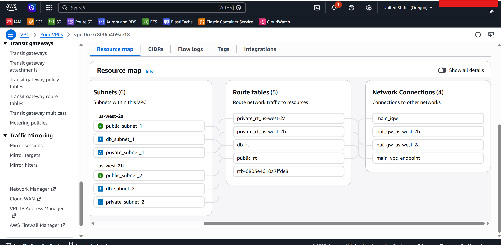

# AWS Document Verification Platform

A production-grade document verification platform deployed on AWS using Terraform, demonstrating multi-tier cloud architecture, container orchestration, and infrastructure as code across the full operational lifecycle — including the real-world incidents and decisions that came with building it.

> **Lab objective:** Built to demonstrate hands-on AWS infrastructure skills beyond whiteboard architecture. Every design decision, Terraform module, networking configuration, and operational incident documented here was encountered and resolved during actual deployment.

---

## Architecture


---

## Platform in Action

**Application**

| Document Upload | Verification Result | Session History |
|---|---|---|
|  |  |  |

**Infrastructure (live AWS console)**

| ECS Tasks Running | ALB Targets Healthy |
|---|---|
|  |  |

| RDS Multi-AZ | VPC Resource Map |
|---|---|
|  |  |

Full screenshots (CloudWatch metrics, ECR, S3, Route 53, CloudFront origins, ECS resource details): [`docs/screenshots/`](docs/screenshots/)

---

## What This Platform Does

Users upload identity documents (passports, driver's licenses) through a web interface. The platform processes each document through Regula Document Reader — a commercial forensic document recognition engine — extracts structured fields (name, date of birth, document number, MRZ data), validates document authenticity, and stores the session with document crop images for history and audit purposes.

The stack is designed around how a real ISV or enterprise would deploy this workload: private subnets for compute and data, public-only ALB exposure, secrets injected at runtime from SSM, static frontend served via CloudFront, and CI/CD on every push to main.

---

## AWS Services & Design Decisions

| Service | Role | Why this, not the alternative |
|---|---|---|
| **ECS Fargate** | Container orchestration for Python API + Regula | Chosen over EKS — no control plane to manage, right-sized for a two-container workload, simpler operational model |
| **Application Load Balancer** | HTTPS termination, health-based routing to ECS tasks | Layer 7 routing required for path-based rules (`/api/*`), health checks drive ECS task replacement |
| **RDS PostgreSQL (Multi-AZ)** | Session storage, document metadata | Managed failover, automated backups; Multi-AZ for HA without read replica complexity |
| **Amazon S3** | Static frontend hosting + document crop image storage | Two separate buckets: one OAC-protected for frontend (CloudFront only), one for images with presigned URL access |
| **CloudFront** | CDN for frontend, SSL termination, cache | Origin Access Control (OAC, not legacy OAI) for frontend bucket; routes `/api/*` to ALB origin |
| **ACM** | SSL/TLS certificates | DNS-validated; separate cert per region (ALB cert in `us-west-2`, CloudFront requires `us-east-1`) |
| **ECR** | Private container registry | Regula image mirrored once to ECR; eliminates Docker Hub dependency and runtime pull costs |
| **SSM Parameter Store** | Database credentials | `SecureString` type; injected into ECS task definitions via `secrets` block at container start, never in code or tfvars |
| **Route 53** | DNS for `api.` subdomain | Migrated from Namecheap mid-project after DNS panel failures blocked certificate validation |
| **CloudWatch** | Container logs, metrics | ECS task logs streamed via `awslogs` driver; custom metrics available for autoscaling |
| **Application Auto Scaling** | ECS task count scaling | Target tracking on CPU utilization; configured min/max/desired task counts |
| **IAM** | Least-privilege roles | Separate ECS Execution Role (infrastructure: ECR pull, SSM read, CloudWatch write) and Task Role (application: S3 read/write) |

---

## Infrastructure Layout

```
VPC (10.0.0.0/16)
├── Public Subnets (2 × AZ)       — ALB only
├── Private Subnets (2 × AZ)      — ECS tasks (Python API + Regula)
└── DB Subnets (2 × AZ)           — RDS PostgreSQL (Multi-AZ)

Routing:
  Public  → Internet Gateway
  Private → NAT Gateways (1 per AZ, AZ-local routing), required for Regula License validation
  DB      → Local only (no outbound internet)
  All     → S3 Gateway Endpoint (free, keeps S3 traffic off NAT)
```

Six subnets across three tiers and two availability zones. ECS tasks in private subnets have outbound internet via AZ-local NAT Gateways. RDS in isolated DB subnets with no internet path.

---

## Key Incidents & Decisions

This project was designed to encounter and resolve real operational problems. The full writeup is in [`docs/challenges-and-decisions.md`](docs/challenges-and-decisions.md). Summary:

| Incident | Impact | Resolution |
|---|---|---|
| Regula container OOM crash loop | ~100 GB NAT Gateway egress in 3 hours | Sized task to 8 GB RAM (iterated 512 MB → 4 GB → 8 GB); mirrored image to ECR |
| RDS tainted state after connection timeout | Terraform marked RDS for destroy/recreate | Manual `terraform untaint` after verifying resource health |
| ACM cert validation stuck | HTTPS deployment blocked | Migrated DNS from Namecheap to Route 53 for reliable CNAME management |
| CloudFront `CNAMEAlreadyExists` | Re-deploy blocked by stale DNS | Identified and removed orphaned distribution from prior apply |
| ALB target group port mismatch | All health checks failing | Aligned `app_port` variable across ALB TG and ECS task definition |
| ECS execution role missing Secrets Manager permission | Tasks failing to start | Added `ssm:GetParameters` to execution role IAM policy |
| CloudFront cache serving stale `config.js` | Frontend pointing to localhost in production | Added CloudFront invalidation step to CI/CD pipeline |

Full incident writeups: [`docs/challenges-and-decisions.md`](docs/challenges-and-decisions.md)
NAT Gateway cost postmortem: [`docs/challenges-and-decisions.md — section 2.5`](docs/challenges-and-decisions.md#25-nat-gateway-cost-incident--ecs-crash-loop-and-unexpected-data-transfer)

---

## Repository Structure

```
.
├── terraform/
│   ├── environments/
│   │   └── dev/                  # Environment entry point
│   │       ├── main.tf           # Module wiring
│   │       ├── variables.tf
│   │       ├── terraform.tfvars
│   │       └── providers.tf      # Multi-region provider aliases (us-west-2 + us-east-1)
│   └── modules/
│       ├── networking/           # VPC, subnets, IGW, NAT, route tables, S3 endpoint
│       ├── security/             # Security groups (ALB, ECS, RDS), IAM-adjacent SG rules
│       ├── iam/                  # ECS execution role, task role, policies
│       ├── storage/              # RDS PostgreSQL, S3 buckets
│       ├── ecs/                  # ECS cluster, task definition, service, ALB, ACM, autoscaling
│       └── frontend/             # CloudFront distribution, OAC, Route 53 records
├── services/
│   ├── python-api/               # FastAPI application (containerized)
│   └── frontend/                 # Static HTML/CSS/JS
├── docs/
│   ├── architecture.md           # Deep dive: network topology, security, HA design
│   ├── terraform.md              # Module reference, deployment guide, state management
│   ├── services.md               # Application layer: Python API, Regula, frontend
│   ├── challenges-and-decisions.md  # Incidents, root causes, architectural decisions
└── .github/workflows/
    ├── plan.yml                  # CI/CD step 1: validate → plan, saves artifact, posts diff to job summary
    ├── apply.yml                 # CI/CD step 2: apply saved plan → ECS redeploy → frontend → health check
    └── destroy.yml               # Safe teardown: confirmation input → plan-destroy → approve → destroy → verify
```

---

## Documentation Index

| Document | What it covers |
|---|---|
| [Architecture](docs/architecture.md) | Network design, security model, HA approach, traffic flows |
| [Terraform](docs/terraform.md) | Module structure, remote state, deployment steps, variables |
| [Services](docs/services.md) | Python API internals, Regula integration, frontend |
| [Challenges & Decisions](docs/challenges-and-decisions.md) | Every incident encountered, root causes, resolutions, design decisions |
| [NAT Gateway Postmortem](docs/challenges-and-decisions.md#25-nat-gateway-cost-incident--ecs-crash-loop-and-unexpected-data-transfer) | ~100 GB unexpected NAT data transfer — deep dive on ECS image pull behavior and VPC routing |
| [Scaling to Production](docs/scaling.md) | What changes at 1M users/day: async SQS processing, Aurora Serverless v2, multi-region |

---

## Prerequisites

- AWS CLI configured with appropriate permissions
- Terraform >= 1.5
- Docker (to mirror Regula image to ECR before first deploy)
- Domain registered and accessible for DNS management

---

## Deployment Overview

```bash
# 1. Mirror Regula image to ECR (one-time, required before terraform apply)
aws ecr get-login-password --region us-west-2 | docker login --username AWS --password-stdin <account>.dkr.ecr.us-west-2.amazonaws.com
docker pull regulaforensics/docreader:latest
docker tag regulaforensics/docreader:latest <account>.dkr.ecr.us-west-2.amazonaws.com/regula-ecs-lab-dev-docreader:latest
docker push <account>.dkr.ecr.us-west-2.amazonaws.com/regula-ecs-lab-dev-docreader:latest

# 2. Store credentials in SSM Parameter Store
aws ssm put-parameter --name "/regula/dev/db_username" --value "your_username" --type String
aws ssm put-parameter --name "/regula/dev/db_password" --value "your_password" --type SecureString

# 3. Deploy infrastructure
cd terraform/environments/dev
terraform init
terraform apply
```

Full deployment guide: [`docs/terraform.md`](docs/terraform.md)

---

## Local Development

```bash
cd services/python-api
docker compose up
# API: http://localhost:8001
# Regula: http://localhost:8080
# Swagger docs: http://localhost:8001/docs
```

---

## CI/CD

Three workflows in `.github/workflows/`. Deploy is split into two separate workflows — Plan and Apply — to provide a manual review gate without requiring a paid GitHub plan.

**Plan** (`plan.yml`) — run this first, manually:
1. Validate — `terraform fmt -check` + `terraform validate`
2. Plan — `terraform plan`, full diff posted to job summary, plan binary saved as artifact

After it completes, copy the Run ID from the URL and review the plan output in the job summary.

**Apply** (`apply.yml`) — run manually after reviewing the plan:
1. Terraform apply — downloads the saved plan artifact by Run ID and applies it exactly as reviewed
2. ECS redeploy — (optional, checkbox) `--force-new-deployment` so ECS picks up a new ECR image
3. Frontend — `aws s3 sync` + CloudFront cache invalidation
4. Health check — ALB target group health + ECS service state
5. Summary — full status table, always runs even on failure

> **Stale plan:** if a previous Apply run partially succeeded and you need to retry, always re-run Plan first to get a fresh plan before triggering Apply. Re-using an old plan after a partial apply will fail with "Saved plan is stale."

**Destroy** (`destroy.yml`) — manual only, three safety layers: must type `DESTROY` in the input, plan-destroy shows every resource that will be deleted, requires a second approval before executing.

**ECR images** are managed manually for this lab. Push a new image to ECR, check "Redeploy ECS containers?" when triggering Apply — ECS picks up the new `latest` automatically.

Credentials stored as GitHub repository secrets (`AWS_ACCESS_KEY_ID`, `AWS_SECRET_ACCESS_KEY`).

---

## Development Notes

The Python API and frontend were scaffolded with AI coding assistance (Claude) to focus lab time on cloud infrastructure design and Terraform implementation. VS Code with GitHub Copilot assisted with Terraform authoring. All Terraform modules, AWS architecture decisions, network configuration, IAM policies, and incident resolution were designed and implemented manually. The Regula SDK integration and API routing logic were also configured manually based on Regula's documentation.
